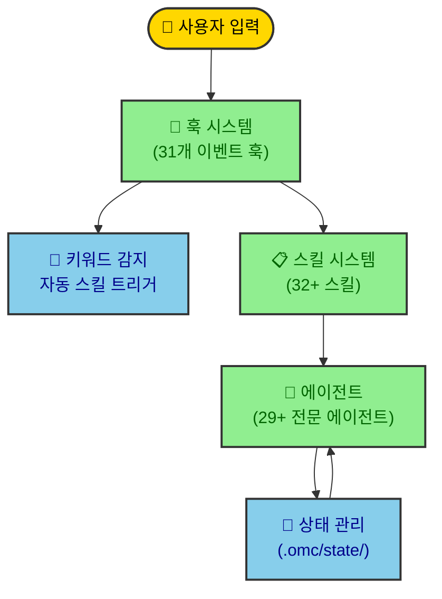
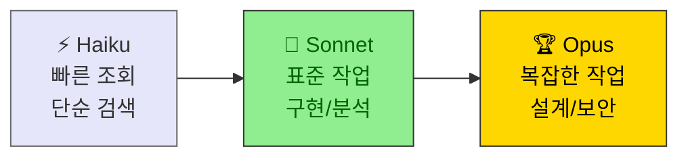
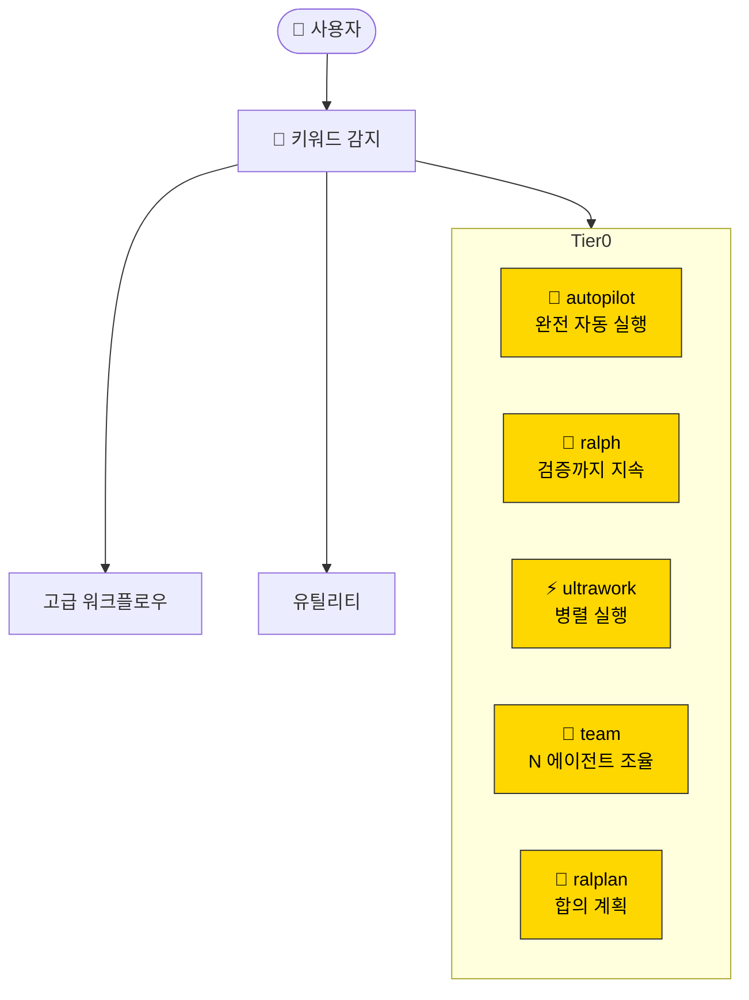
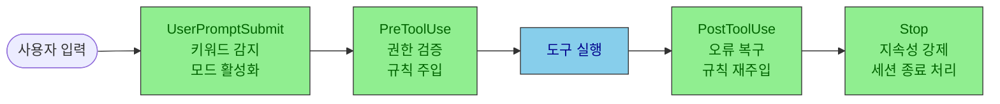
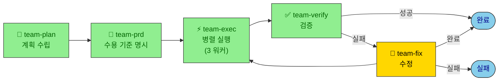
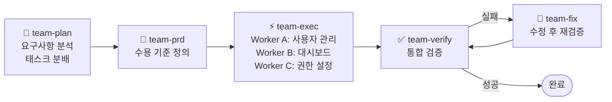

# oh-my-claudecode (OMC) 내부 구조

**버전**: v4.9.1
**분석일**: 2026-03-28

---

## 목차

1. [개요](#1-개요)
2. [디렉토리 구조](#2-디렉토리-구조)
3. [핵심 설정 파일](#3-핵심-설정-파일)
4. [에이전트 시스템](#4-에이전트-시스템)
5. [스킬 시스템](#5-스킬-시스템)
6. [훅(Hooks) 시스템](#6-훅hooks-시스템)
7. [상태 관리](#7-상태-관리)
8. [팀 파이프라인](#8-팀-파이프라인)
9. [MCP 서버 연동](#9-mcp-서버-연동)
10. [HUD 시스템](#10-hud-시스템)
11. [매직 키워드](#11-매직-키워드)
12. [환경 변수](#12-환경-변수)
13. [사용 예시](#13-사용-예시)

---

## 1. 개요

OMC는 Claude Code 위에 구축된 **멀티 에이전트 오케스트레이션 레이어**다. 4가지 핵심 구성 요소로 이루어져 있다:



| 구성 요소 | 수량 | 역할 |
|---------|------|------|
| 에이전트 | 29+ | 전문화된 AI 작업자 |
| 스킬 | 32+ | 재사용 가능한 워크플로우 |
| 훅 | 31개 | 라이프사이클 이벤트 처리 |
| 실행 모드 | 8개 | autopilot, ralph, ultrawork 등 |

---

## 2. 디렉토리 구조

### 2.1 프로젝트 로컬 상태 (`.omc/`)

```
{프로젝트}/.omc/
├── project-memory.json          # 프로젝트 메타데이터, 핫패스 추적
├── sessions/
│   └── {sessionId}.json         # 세션별 진행 스냅샷
└── state/
    ├── mission-state.json        # 현재 실행 중인 미션
    ├── hud-state.json            # HUD 스태이터스라인 상태
    ├── subagent-tracking.json    # 스폰된 서브에이전트 추적
    ├── autopilot-state.json      # autopilot 진행 상태
    ├── ralph-state.json          # ralph 루프 상태
    └── agent-replay-*.jsonl      # 에이전트 리플레이 로그
```

### 2.2 전역 사용자 설정 (`~/.claude/`)

```
~/.claude/
├── CLAUDE.md                    # OMC 핵심 운영 가이드 (v4.9.1)
├── settings.json                # Claude Code 설정
├── .omc-config.json             # OMC 프로젝트 설정
├── hud/
│   └── omc-hud.mjs              # 스태이터스라인 표시 스크립트
├── plugins/
│   ├── installed_plugins.json   # 설치된 플러그인 레지스트리
│   └── cache/omc/oh-my-claudecode/4.9.1/  # 플러그인 소스 캐시
├── skills/                      # 설치된 스킬
└── history.jsonl                # 사용자 상호작용 기록
```

---

## 3. 핵심 설정 파일

### 3.1 CLAUDE.md

모든 에이전트/스킬이 참조하는 **OMC 운영 지침**의 중추.

| 섹션 | 역할 |
|-----|------|
| `<operating_principles>` | 위임, 검증, 경량화 원칙 |
| `<delegation_rules>` | 직접 처리 vs 위임 기준 |
| `<model_routing>` | Haiku/Sonnet/Opus 모델 선택 기준 |
| `<skills>` | Tier-0 워크플로우 정의 |
| `<verification>` | 완성 전 검증 프로토콜 |
| `<execution_protocols>` | 병렬 실행, 백그라운드 작업 규칙 |
| `<hooks_and_context>` | 훅 시스템, 상태 지속성 |

### 3.2 .omc-config.json

```json
{
  "defaultExecutionMode": "ultrawork",
  "team": {
    "maxAgents": 3,
    "defaultAgentType": "executor"
  }
}
```

### 3.3 settings.json

```json
{
  "env": {
    "CLAUDE_CODE_EXPERIMENTAL_AGENT_TEAMS": "1"
  },
  "statusLine": {
    "command": "node $HOME/.claude/hud/omc-hud.mjs"
  }
}
```

---

## 4. 에이전트 시스템

### 모델 계층 구조



### 에이전트 카탈로그

**빌드/분석 레인**

| 에이전트 | 모델 | 역할 |
|---------|------|------|
| `explore` | Haiku | 코드베이스 검색, 파일 탐색 |
| `analyst` | Sonnet | 요구사항 명확화 |
| `planner` | Sonnet | 작업 계획 수립 |
| `architect` | Opus | 시스템 설계, 아키텍처 |
| `debugger` | Sonnet | 근본원인 분석 |
| `executor` | Sonnet | 코드 구현 |
| `verifier` | Opus | 완성 검증 |

**리뷰 레인**

| 에이전트 | 역할 |
|---------|------|
| `code-reviewer` | 코드 품질 리뷰 |
| `security-reviewer` | 보안 취약점 검토 |
| `performance-reviewer` | 성능 분석 |
| `api-reviewer` | API 설계 리뷰 |
| `style-reviewer` | 스타일/컨벤션 |

**도메인 전문가**

`dependency-expert`, `test-engineer`, `quality-strategist`, `designer`, `writer`, `qa-tester`, `git-master`, `researcher`

**제품 레인**

`product-manager`, `ux-researcher`, `information-architect`, `product-analyst`

**조율**

`critic`, `vision`

---

## 5. 스킬 시스템

### 스킬 계층 구조



### Tier-0 워크플로우 비교

| 스킬 | 키워드 | 특징 | 용도 |
|-----|-------|------|------|
| **autopilot** | "autopilot", "build me" | 분석→계획→실행→검증 완전 자동 | 새 기능 구축 |
| **ralph** | "ralph", "don't stop" | 목표 달성까지 루프 반복 | 복잡한 버그 수정 |
| **ultrawork** | "ulw", "ultrawork" | 병렬 태스크 분해·실행 | 대용량 리팩토링 |
| **team** | `/team` 명시 | N개 에이전트 조율 파이프라인 | 대규모 프로젝트 |
| **ralplan** | "ralplan", "consensus" | 합의 기반 전략 계획 | 아키텍처 결정 |

### 고급 워크플로우

| 스킬 | 역할 |
|-----|------|
| `deep-interview` | Socratic 심층 요구사항 인터뷰 |
| `deep-dive` | trace + deep-interview 2단계 파이프라인 |
| `ultraqa` | 테스트→검증→수정 QA 사이클 |
| `visual-verdict` | 스크린샷 시각적 비교 QA |
| `ai-slop-cleaner` | AI 생성 코드 정리 |
| `trace` | 경쟁 가설 기반 근본원인 추적 |

---

## 6. 훅(Hooks) 시스템

### 이벤트 흐름



### 훅 분류 (31개)

| 분류 | 수량 | 예시 |
|-----|------|------|
| **실행 모드** | 8개 | autopilot, ralph, ultrawork, mode-registry |
| **검증** | 4개 | thinking-block-validator, permission-handler |
| **복구** | 3개 | recovery, preemptive-compaction |
| **향상** | 5개 | rules-injector, notepad, learner |
| **감지** | 5개 | keyword-detector, think-mode, auto-slash-command |
| **조율** | 6개 | todo-continuation, omc-orchestrator, subagent-tracker |

---

## 7. 상태 관리

### 상태 저장 위치

| 범위 | 경로 | 설명 |
|-----|------|------|
| 프로젝트 | `.omc/state/{name}.json` | 현재 프로젝트 전용 |
| 전역 | `~/.omc/state/{name}.json` | 사용자 전역 |
| 중앙화 | `$OMC_STATE_DIR/{project-id}/` | 워크트리 삭제 후에도 유지 |

### 주요 상태 파일

| 파일 | 역할 | 주요 필드 |
|-----|------|---------|
| `mission-state.json` | 현재 미션 추적 | agents[], status, timeline |
| `hud-state.json` | 스태이터스라인 표시 | backgroundTasks[], sessionId |
| `subagent-tracking.json` | 에이전트 수명 추적 | agents[], total_spawned |
| `autopilot-state.json` | autopilot 진행 | phase, goal, plan |
| `ralph-state.json` | ralph 루프 상태 | iteration, verified, prd_path |
| `project-memory.json` | 프로젝트 메타 | techStack, hotPaths, conventions |

### 상태 특성

- **캐시 TTL**: 5초 (읽기 성능)
- **자동 정리**: 4시간 이상 된 상태 자동 삭제
- **원자적 쓰기**: 부분 쓰기 방지
- **자동 마이그레이션**: 레거시 경로 → 표준 경로

---

## 8. 팀 파이프라인



### 팀 워커 모델 해결 우선순위

1. 명시적 `--model` 플래그
2. 제공자 모델 env (`ANTHROPIC_MODEL`)
3. 제공자 계층 env (`ANTHROPIC_DEFAULT_SONNET_MODEL`)
4. OMC 계층 env (`OMC_MODEL_MEDIUM`)
5. Claude Code 기본값

---

## 9. MCP 서버 연동

### MCP 환경 변수

| 변수 | 기본값 | 설명 |
|-----|-------|------|
| `OMC_MCP_OUTPUT_PATH_POLICY` | `strict` | 출력 경로 정책 |
| `OMC_MCP_OUTPUT_REDIRECT_DIR` | `.omc/outputs` | 출력 리다이렉트 경로 |
| `OMC_MCP_ALLOW_EXTERNAL_PROMPT` | `0` | 외부 프롬프트 파일 접근 허용 |

### 플러그인 마켓플레이스

| 마켓플레이스 | 소스 | 업데이트 |
|-----------|------|--------|
| **omc** | github.com/Yeachan-Heo/oh-my-claudecode | 자동 |
| **claude-plugins-official** | github (anthropics) | 수동 |

### 설치된 플러그인

- `oh-my-claudecode@omc` v4.9.1
- `skill-creator@claude-plugins-official`
- `mcp-server-dev@claude-plugins-official`

---

## 10. HUD 시스템

스크립트 위치: `~/.claude/hud/omc-hud.mjs`

**로드 우선순위:**

1. 개발 경로 (`OMC_DEV=1` 설정 시)
2. 플러그인 캐시 (`~/.claude/plugins/cache/omc/.../dist/hud/index.js`)
3. npm 패키지
4. 에러 메시지

**settings.json 설정:**

```json
"statusLine": {
  "type": "command",
  "command": "node $HOME/.claude/hud/omc-hud.mjs"
}
```

---

## 11. 매직 키워드

UserPromptSubmit 훅에서 감지되어 즉시 스킬을 자동 트리거한다.

| 키워드 | 트리거 스킬 |
|-------|----------|
| `"ralph"`, `"don't stop"`, `"must complete"` | ralph |
| `"autopilot"`, `"build me"` | autopilot |
| `"ulw"`, `"ultrawork"`, `"parallel"` | ultrawork |
| `"plan this"`, `"plan the"` | plan |
| `"interview"`, `"deep interview"` | deep-interview |
| `"ralplan"`, `"consensus plan"` | ralplan |
| `"ecomode"`, `"eco"`, `"budget"` | ecomode |
| `"cancel"`, `"cancelomc"` | cancel |
| `"tdd"`, `"test first"` | TDD 모드 주입 |
| `"cleanup"`, `"deslop"`, `"anti-slop"` | ai-slop-cleaner |
| `"web-clone"`, `"clone site"` | web-clone |

> 우선순위: 가장 긴 매치(구체적인 것) 우선 적용

---

## 12. 환경 변수

| 변수 | 기본값 | 설명 |
|-----|-------|------|
| `OMC_STATE_DIR` | _(unset)_ | 중앙화 상태 디렉토리 |
| `OMC_PARALLEL_EXECUTION` | `true` | 병렬 실행 활성화 |
| `OMC_LSP_TIMEOUT_MS` | `15000` | LSP 타임아웃 (ms) |
| `DISABLE_OMC` | _(unset)_ | OMC 전체 비활성화 |
| `OMC_SKIP_HOOKS` | _(unset)_ | 특정 훅 스킵 (쉼표 구분) |
| `CLAUDE_CODE_EXPERIMENTAL_AGENT_TEAMS` | `1` | 네이티브 팀 활성화 |

**중앙화 상태 설정 예시:**

```bash
export OMC_STATE_DIR="$HOME/.claude/omc"
# 상태 경로: ~/.claude/omc/{project-id}/
# worktree 삭제 후에도 상태 유지됨
```

---

## 13. 사용 예시

### 예시 1 — 새 기능 완전 자동 구축 (autopilot)

> 새 기능을 처음부터 끝까지 자동으로 구현하고 싶을 때

```
"사용자 인증 기능을 build me — JWT 기반, 로그인/로그아웃/토큰 갱신 포함"
```

**동작 흐름:**
1. `autopilot` 키워드 감지 → autopilot 스킬 자동 실행
2. `explore` 에이전트가 기존 코드 구조 분석
3. `planner`가 구현 계획 수립
4. `executor`가 코드 작성 (병렬)
5. `verifier`가 완성 검증 후 종료

---

### 예시 2 — 복잡한 버그 끝까지 수정 (ralph)

> 루프를 돌며 검증이 통과할 때까지 자동 반복

```
"결제 모듈에서 간헐적으로 500 에러가 발생해. ralph로 근본 원인 찾아서 고쳐줘"
```

**동작 흐름:**
1. `ralph` 키워드 감지 → ralph 스킬 실행
2. `debugger`가 스택 트레이스 분석 및 가설 수립
3. `executor`가 수정 적용
4. `verifier`가 검증 → 실패 시 2번으로 되돌아가 반복
5. 검증 통과 시 종료

---

### 예시 3 — 대규모 병렬 리팩토링 (ultrawork)

> 여러 파일을 동시에 수정해야 하는 대용량 작업

```
"ulw — 전체 API 레이어를 REST에서 tRPC로 마이그레이션해줘"
```

**동작 흐름:**
1. `ulw` 키워드 감지 → ultrawork 스킬 실행
2. 태스크를 파일/모듈 단위로 분해
3. 3개 `executor` 에이전트가 병렬로 각 파일 수정
4. 완료된 태스크 집계 및 충돌 해결
5. 전체 검증 후 종료

---

### 예시 4 — 아키텍처 설계 합의 (ralplan)

> 중요한 기술 결정을 내리기 전 여러 관점에서 검토

```
"ralplan — 모노레포 vs 멀티레포 중 어떤 구조가 우리 팀에 맞는지 분석해줘"
```

**동작 흐름:**
1. `ralplan` 키워드 감지 → ralplan 스킬 실행
2. `architect`(Opus)가 옵션별 장단점 분석
3. `critic`이 반론 및 엣지케이스 검토
4. `planner`가 최종 합의안 도출
5. 결정 근거와 실행 계획 문서화

---

### 예시 5 — 팀 에이전트 조율 (team)

> 대규모 프로젝트를 계획부터 검증까지 N개 에이전트가 협력해서 처리

```
/team "백오피스 어드민 페이지 구축 — 사용자 관리, 통계 대시보드, 권한 설정 포함"
```

**동작 흐름:**



- `team-plan`: 전체 작업을 3개 독립 태스크로 분해
- `team-exec`: 각 워커가 병렬로 담당 모듈 구현
- `team-verify`: 통합 후 전체 동작 검증
- `/team` 명시 호출 필요 (키워드 자동 트리거 없음)

---

### 예시 6 — 요구사항 심층 인터뷰 (deep-interview)


> 막연한 아이디어를 구체적인 스펙으로 발전시킬 때

```
"deep interview — 대시보드 기능을 만들고 싶은데 뭐가 필요한지 모르겠어"
```

**동작 흐름:**
1. `deep interview` 키워드 감지 → deep-interview 스킬 실행
2. Socratic 방식으로 목표·사용자·제약 조건 질문
3. 수집된 답변을 기반으로 요구사항 명세 초안 작성
4. 모호한 항목 재질문으로 명확화
5. 최종 PRD(제품 요구사항 문서) 산출
